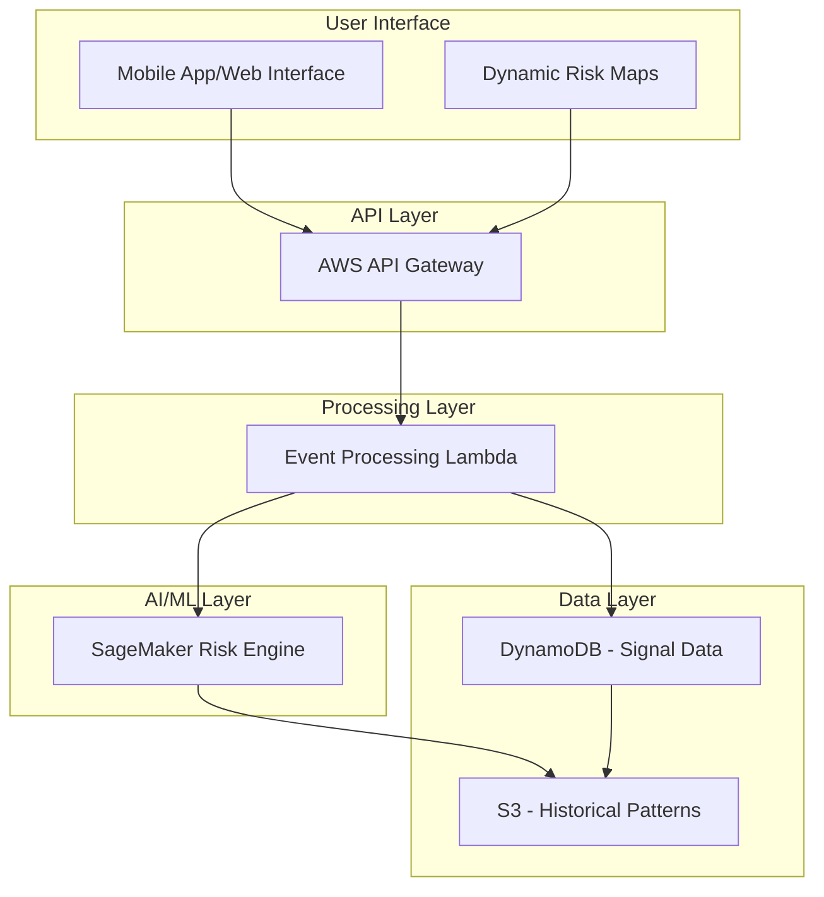

# Design Document

## Overview

Rakshak is an AI-powered safety intelligence platform that transforms anonymized SOS signals into area-level risk awareness. The system operates as a serverless, cloud-native application on AWS, designed for MVP deployment with a focus on privacy, scalability, and advisory-only outputs.

The platform consists of three core components: SOS Signal Ingestion (serverless event processing), AI Risk Engine (pattern analysis and scoring), and Risk Visualization (dynamic maps and user interface). All components are designed with privacy-by-design principles, ensuring no personally identifiable information is collected or stored.

## Architecture

### High-Level Architecture



### Component Architecture

**API Layer:**
- AWS API Gateway provides REST endpoints for SOS signal submission and risk data queries
- Handles basic request routing and validation

**Processing Layer:**
- **Event Processing Lambda**: Single serverless function that receives SOS signals, anonymizes data, stores in DynamoDB, and triggers risk calculations
- Handles both signal ingestion and risk score computation

**AI/ML Layer:**
- **SageMaker Risk Engine**: Hosted ML model that analyzes spatio-temporal patterns in SOS signals and generates area-level risk scores

**Data Layer:**
- **DynamoDB**: Stores anonymized SOS signals with automatic data expiration
- **S3**: Archives aggregated historical patterns for periodic model training

## Components and Interfaces

### SOS Signal Ingestion

**Interface:**
```json
POST /api/v1/sos
{
  "latitude": 28.6139,
  "longitude": 77.2090,
  "timestamp": "2024-01-15T10:30:00Z"
}
```

**Processing Flow:**
1. Validate input coordinates and timestamp
2. Generate anonymous signal ID (UUID)
3. Store in DynamoDB with TTL (30 days)
4. Trigger risk calculation asynchronously
5. Return acknowledgment to client

**Privacy Controls:**
- No user identification collected
- IP addresses not logged
- Coordinates rounded to protect precise locations
- Automatic data expiration via DynamoDB TTL

### AI Risk Engine

### AI Risk Engine

**Conceptual Approach:**
The Risk Engine uses spatio-temporal pattern detection to identify areas with elevated safety concerns based on SOS signal clustering:

1. **Spatial Analysis**: Groups SOS signals within geographic proximity to identify hotspots
2. **Temporal Analysis**: Analyzes signal frequency patterns over time to detect emerging trends
3. **Risk Scoring**: Combines spatial and temporal factors to generate area-level risk assessments

**Risk Classification:**
- **Low Risk**: Few or no recent signals in the area (Green)
- **Medium Risk**: Moderate signal activity suggesting increased attention (Yellow)  
- **High Risk**: Concentrated signal activity indicating heightened concern (Red)

**Model Training:**
- Periodic model updates using aggregated historical data
- Focus on pattern recognition rather than individual event prediction
- Maintains privacy through area-level aggregation only

### Risk Visualization

**Map Data API:**
```json
GET /api/v1/risk-map?lat=28.6139&lng=77.2090&radius=5000

Response:
{
  "areas": [
    {
      "center": {"lat": 28.6139, "lng": 77.2090},
      "risk_level": "medium",
      "confidence": "moderate",
      "last_updated": "2024-01-15T10:45:00Z"
    }
  ]
}
```

**Visualization Features:**
- Color-coded risk areas on interactive map
- Risk level indicators with confidence levels
- Data freshness timestamps

## Data Models

### SOS Signal Record

```json
{
  "signal_id": "uuid-string",
  "latitude": 28.6139,
  "longitude": 77.2090,
  "timestamp": "2024-01-15T10:30:00Z",
  "area_id": "grid_28.61_77.21"
}
```

**Key Design Decisions:**
- `area_id`: Geographic grouping for area-level analysis
- No user or device identifiers
- Automatic data expiration after 30 days

### Risk Assessment Record

```json
{
  "area_id": "grid_28.61_77.21",
  "risk_level": "medium",
  "confidence": "moderate",
  "signal_count": 12,
  "calculated_at": "2024-01-15T10:45:00Z"
}
```

## Correctness Properties

*A property is a characteristic or behavior that should hold true across all valid executions of a system—essentially, a formal statement about what the system should do. Properties serve as the bridge between human-readable specifications and machine-verifiable correctness guarantees.*

Before defining the correctness properties, let me analyze the acceptance criteria to determine which ones are testable as properties, examples, or edge cases.

### Core System Properties

The system must maintain several key properties to ensure privacy, accuracy, and reliability:

**Privacy Protection:**
- All SOS signals are immediately anonymized upon collection
- No personally identifiable information is stored or processed
- Data is aggregated at area level to prevent individual tracking

**Risk Assessment Accuracy:**
- Risk levels are consistently classified as Low, Medium, or High
- All risk information includes confidence indicators
- Risk calculations incorporate both spatial and temporal patterns

**Advisory-Only Presentation:**
- All outputs are presented as advisory guidance with appropriate disclaimers
- System avoids certainty claims or prescriptive language
- Users receive probabilistic risk information, not guarantees

**Data Lifecycle Management:**
- Historical data is maintained in aggregated form only
- Individual signal records are automatically purged after retention period
- System maintains audit trails for data operations

## Error Handling

### Error Response Strategy

**Input Validation:**
- Invalid coordinates or missing required fields return descriptive error messages
- Malformed requests are rejected with appropriate HTTP status codes
- System continues processing valid requests despite individual failures

**Processing Errors:**
- AI Risk Engine unavailability triggers fallback to basic risk assessment
- Database connection issues use cached data when available
- Graceful degradation maintains core functionality during partial outages

**Privacy Protection:**
- Immediate data purging if PII is accidentally detected
- System alerts for potential privacy violations
- Fail-safe approach prioritizes privacy over functionality

## Testing Strategy

### Testing Approach

The system will be validated through unit and integration testing to ensure core functionality and privacy constraints are met:

**Unit Testing Focus:**
- SOS signal processing and anonymization
- Risk calculation logic and classification
- Privacy protection mechanisms
- Error handling and edge cases

**Integration Testing Focus:**
- End-to-end API workflows from signal submission to risk retrieval
- AWS service integration (Lambda, DynamoDB, SageMaker)
- Data flow validation across system components
- Privacy compliance verification

**Key Testing Areas:**
- Verify no PII is collected or stored at any point
- Confirm risk levels are properly classified and presented
- Validate advisory-only language in all outputs
- Test system behavior under various load conditions
- Ensure proper data lifecycle management

## Privacy Considerations

### Privacy-by-Design Implementation

**Data Minimization:**
- Collect only essential data: location coordinates and timestamp
- No user identification, session tracking, or device information
- Coordinate precision limited to protect exact locations

**Anonymization at Collection:**
- Generate anonymous signal IDs for system tracking only
- No correlation with user identity or device characteristics
- Immediate anonymization upon data receipt

**Area-Level Aggregation:**
- All risk assessments operate at geographic area level
- Individual signals cannot be traced or identified
- Statistical aggregation prevents individual pattern recognition

### Privacy Safeguards

**Data Protection:**
- Automatic data expiration (30-day retention)
- Encryption for data at rest and in transit
- Access controls using AWS IAM policies

**Compliance Principles:**
- Purpose limitation: Data used only for safety risk assessment
- No personal data accuracy requirements (no personal data stored)
- Accountability through basic audit logging

## Scalability

### Serverless Architecture Benefits

**Automatic Scaling:**
- AWS Lambda automatically scales based on request volume
- DynamoDB on-demand scaling handles variable traffic
- SageMaker endpoints can be configured for expected load
- Pay-per-use cost model suitable for MVP deployment

**Managed Services Approach:**
- Leverages AWS managed services to minimize operational overhead
- Built-in high availability and fault tolerance
- No infrastructure management required for core functionality

### Performance Considerations

**Response Time:**
- Lambda functions provide reasonable response times for MVP
- DynamoDB offers consistent performance for data operations
- SageMaker inference endpoints handle AI model predictions

**Cost Optimization:**
- On-demand pricing aligns costs with actual usage
- Serverless architecture eliminates idle resource costs
- Suitable for unpredictable traffic patterns during MVP phase

## System Limitations

### Functional Scope

**Advisory Nature:**
- Provides probabilistic risk information, not guarantees
- Cannot predict or prevent specific incidents
- Effectiveness depends on user adoption and signal volume

**Data Dependencies:**
- Requires sufficient user base for meaningful patterns
- Limited to areas with adequate smartphone adoption
- Vulnerable to false signals or coordinated misuse

**Geographic Coverage:**
- Most effective in urban areas with higher population density
- Limited effectiveness in sparsely populated regions
- Requires localized deployment and tuning

### Technical Constraints

**Accuracy Limitations:**
- Risk assessments are probabilistic estimates
- Quality depends on quantity and distribution of SOS signals
- Temporal and geographic biases may affect accuracy

**MVP Boundaries:**
- Basic AI models suitable for proof-of-concept
- Limited historical data for pattern recognition initially
- Simplified risk classification (Low/Medium/High only)

## Future Enhancements

### Potential Improvements

**Enhanced AI Capabilities:**
- More sophisticated pattern recognition algorithms
- Integration with external data sources (weather, events)
- Improved confidence scoring and uncertainty quantification

**User Experience:**
- Mobile app with offline capabilities
- Route planning integration
- Community safety reporting features

**Platform Expansion:**
- Multi-city deployment framework
- Integration with public safety initiatives
- Academic research partnerships for safety analytics

### Long-term Vision

**Responsible AI Development:**
- Continuous bias monitoring and mitigation
- Transparent algorithmic decision-making
- Community engagement in system development

**Ethical Considerations:**
- Regular evaluation of societal impact
- User education about proper system interpretation
- Clear boundaries on system capabilities and limitations